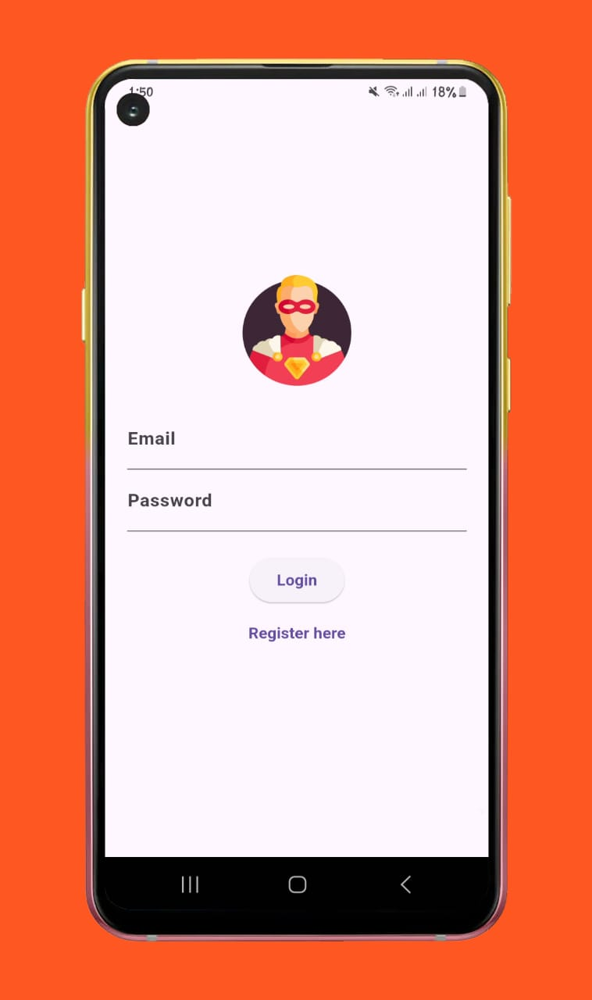
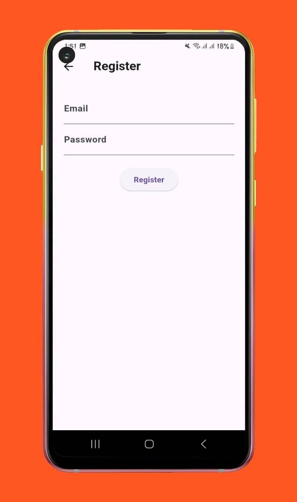
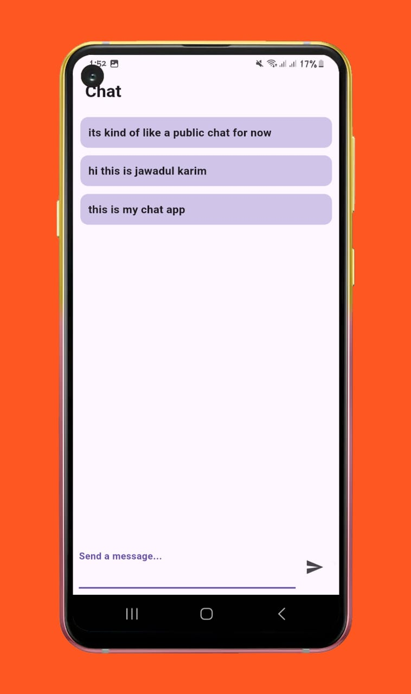

# Linkify - Chat Application

A functional and beautiful real-time chat application built using Flutter and Firebase for Android. The app features user-friendly design and supports real-time messaging.

---

## Features

- Real-time chat
- Firebase integration
- Beautiful UI
- Secure and fast
- Scalable and extendable

---

## Screenshots

Below are some screenshots of the app:

| Login Screen                   | Register Screen                       | Chat Screen                   |
|--------------------------------|---------------------------------------|-------------------------------|
|  |  |  |
---

## APK Download

Click [here](https://drive.google.com/file/d/1-OL3dQNthQO34NVRWSPWbrM4io7OOgll/view?usp=sharing) to download the latest APK.

---

## How to Run Locally

Follow these steps to set up the project on your local machine.

### Prerequisites

- Flutter SDK installed ([Setup Guide](https://flutter.dev/docs/get-started/install))
- Firebase account
- Android Studio or Visual Studio Code
- Java Development Kit (JDK) installed

### Firebase Setup

1. [Set up Firebase for Android](https://firebase.google.com/docs/android/setup).
2. Download the `google-services.json` file from Firebase and place it in the `android/app` directory.

### Installation

1. Clone the repository:
   ```bash
   git clone https://github.com/NissanJK/linkify.git
   cd linkify
   ```

2. Install dependencies:
   ```bash
   flutter pub get
   ```

3. Run the app:
   ```bash
   flutter run
   ```

---

## Folder Structure

```
linkify/
├── android/                 # Native Android configurations
├── assets/                  # App assets like images
├── lib/                     # Flutter app code
│   ├── models/              # Data models
│   ├── screens/             # Screens UI
│   ├── widgets/             # Reusable widgets
│   ├── main.dart            # Entry point of the app
│   ├── auth_service.dart    # Authentication service of the app
├── screenshots/             # Add your app screenshots here
└── pubspec.yaml             # Project dependencies
```

---

## Built With

- **Flutter**: UI toolkit for building natively compiled applications.
- **Firebase**: Backend services for real-time database and authentication.
- **Dart**: Programming language for Flutter.

